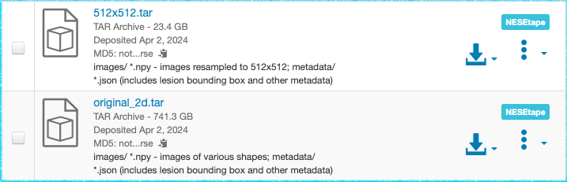

# Quick Start: Downloading data from NESE via Globus

This is a simplified instruction on how to download files from NESE to your personal computer. A more [detailed guide](download.md) is available with information on extra use cases, troubleshooting and more. 

## 1. NESE Large Data Storage at Dataverse 

Files stored on remote Large Data volumes at NESE are identified on Dataset pages by an extra blue label with the name of the volume. In the following example the two files shown are stored on tape at NESE: 

Data at NESE storage can be accessed using Globus transfer protocol (no HTTP access is available). This requires a free Globus client to be installed on your computer:

## 2. Globus Connect Personal 

[Globus Connect Personal](https://www.globus.org/globus-connect-personal) is a free client offered by Globus. Linux, Mac and Windows versions are available.

In order to complete the installation you will be asked to log in as a Globus user. You will likely be able to log in using your school or institution's federated login. If this is not an option, if your institution does not appear in the list of participating organizations, you can create a Globus Id at [globusid.org](https://www.globusid.org).

Once Globus Personal Connect is installed, you will need to make sure it is started before you can initiate any Globus downloads from Dataverse.

## 3. Initiate the Download

Downloads can only be initiated from dataset pages at Harvard Dataverse. (I.e. these files cannot be accessed via Globus directly in a way that bypasses Dataverse).    

To download a single file, open the _File Access_ menu and click on the blue _Globus Transfer_ icon:

Dataverse will then redirect you to the dedicated Globus user interface ("dataverse-globus") in a new tab.

Unless you are already logged in, you will be further redirected to the Globus login page. Make sure you are using the same Globus account that you used to configure your instance of Globus Connect Personal:

You will see an error message if your Globus Connect Personal isn't running. Then simply close the tab, start Globus Connect Personal and try again.

The Globus webapp should now present you the following view with 2 panels. The file you selected should appear as the "source" on the left. Your local home directory should appear as the "destination" on the right:

Check the box next to the file you are downloading:

then click _Submit Transfer_ at the bottom of the page:

You should see the "Transfer Initiated" message. Note that you can safely close the dataverse-globus tab, and any other Dataverse pages at this point. The download is now happening directly between the Globus endpoint at NESE and your instance of Globus Connect Personal. The latter needs to be running for the duration of the proces. However, it can be safely stopped and restarted and your computer can be disconnected from the network, and Globus will automatically resume the transfer when it's back online.  

With long-running downloads of large files, the [Activity](https://app.globus.org/activity) tab on the central Globus Web App site can be used to monitor the progress of the transfers.

