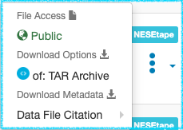
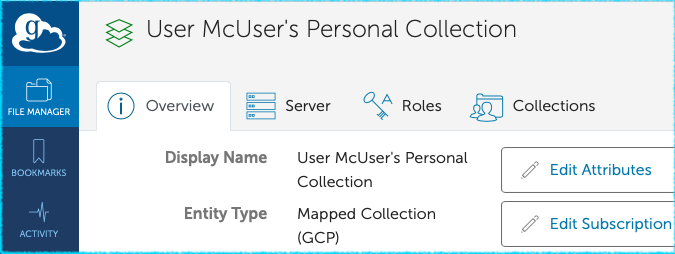
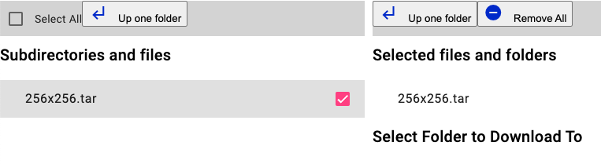

# Downloading data via Globus in the Harvard IQSS Dataverse Archive.

## Summary/Introduction

This is a new and experimental feature offered by Harvard Dataverse in collaboration with Mass. Open Cloud (MOC) and Northeast Storage Exchange (NESE) for researchers looking to deposit large amounts (TBs) of data (aka "Big Data"). This service combines the curation, publishing and access control facilities of Dataverse with the existing Big Data storage infrastructure at NESE.

The single most important thing to keep in mind about this service is that the data are accessible via [Globus Data Transfer](https://www.globus.org/data-transfer) inerface only. Globus makes TB-sized downloads practical, it offers a wide range of advanced features, handling interruptions and restart transparently in the background (among other things). It is also a limitation, as the download process is significantly more complicated than the traditional download methods, via the web pages or the API, offered on "normal" data files that Dataverse stores locally. (In other words, the process involves more steps than simply clicking on a download link in the browser and having the file saved on our computer). 

The files are physically stored at the NESE facility (on tape and/or disk volumes there). Dataverse merely facilitates access to these storage "end points" for users' Globus clients. Neither downloads or downloads are streamed through Dataverse, but are carried out directly between the Globus end points.

## Identifying Globus-stored Data Files in Dataverse

Globus-accessible Datafiles are identified on Dataset pages by an extra blue label with the name of the specific Globus storage volume. In the following example the 2 files are shown to be stored on tape at NESE: 

In the file download menu, an extra blue _Globus Transfer_ icon indicates that instead of a traditional browser download a Globus-specific download workflow will be initiated:

## Globus pre-requisites:

### Globus account is required in order to use Globus technology

You may already be able to log in as a Globus user using your school or institution's federated login. Visit [www.globus.org](https://www.globus.org) and click "Login" at the top of the page check the list of participating authentication providers offered. If an institutional login is not an option, you can create a (free) Globus Id at https://globusid.org. For more infiormation [How To Log In and Transfer Files with Globus ](https://docs.globus.org/guides/tutorials/manage-files/transfer-files/).

### Globus Connect Personal 

[Globus Connect Personal](https://www.globus.org/globus-connect-personal) needs to be installed on the user's local system. 

Once Globus Connect Personal is installed, you will be asked to log in using your Globus account. Globus protocol is based around the idea of transferring data between _collections_. Connect Personal will create a Globus Collection on your computer - your home directory, by default - that can be used as the destination end point for data transfers. Note that it is definitely possible to transfer data to collections other than the one on your laptop - you may, for example, facilitate a transfer to an end point hosted by your school where you have write access. But for the purposes of this instruction, we are working on the assumption that you are downloading the data locally. 

Verify that your new collection is properly set up by clicking the "View Collection Details" in the menu (MacOS version shown):

This should take you to the Globus Web App page, confirming that your personal collection is now part of the Globus federation:

Since you will be transferring data into your collection, make sure that "Write Access" is checked in the _Access_ panel under _Preferences_. Keep the "Shareable" box unchecked, unless you actually have a need to make your personal collection accessible to any other Globus users.

## Initiating a Globus download from Dataverse - Borealis Globus App

The download process relies on an extra software component, [dataverse-globus](https://github.com/scholarsportal/dataverse-globus), a web tool that serves as an interface between Dataverse and Globuas, developed by Borealis (formerly Scholars Portal), the Canadian Dataverse Repository project. Clicking on the Globus Transfer icon in the _File Access_ menu in the Dataverse UI will redirect you to the web app in a new tab.

The Globus App will inform you if Globus Connect isn't installed or properly configured on your local system:

Otherwise you will be prompted to log in using your Globus credentials (make sure you are using the same Globus account that your instance of Globus Connect Personal is configured with!). Then the app will present the view with 2 panels, source and destination, with the file you selected on the left and your personal collection (i.e., your home directory) on the right: 

Check the box next to the file you are downloading:

then click _Submit Transfer_ at the bottom of the page:

You should see the "Transfer Initiated" message. You can safely close the Globus App tab at this point, since its job is done. The transfer is now happening between the 2 Globus endpoints directly (your instance of Globus Connect Personal needs to be running for the duration of the proces).

Please keep in mind the experimental and _work in progress_ nature of both the Globus integration support in Dataverse and the third party Globus app. Please report to us any problems you may encounter in the process. 