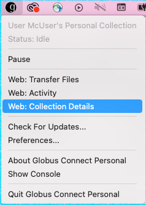
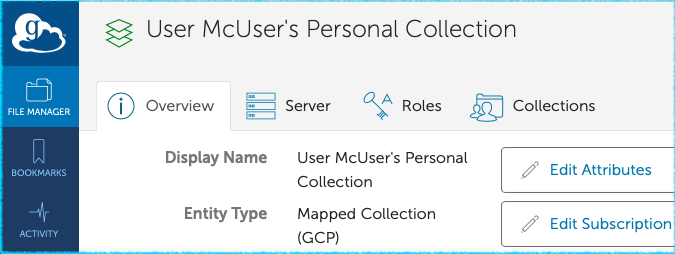
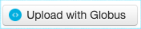
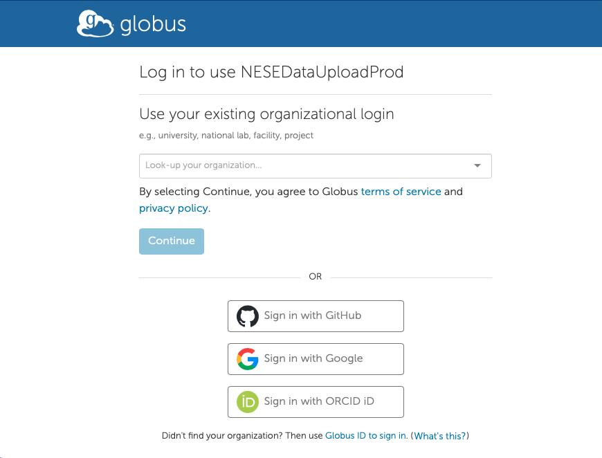
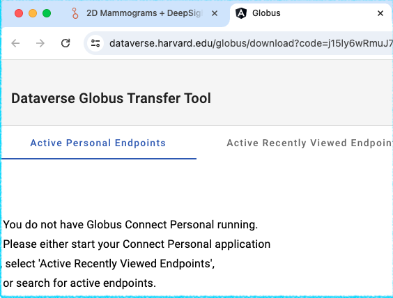
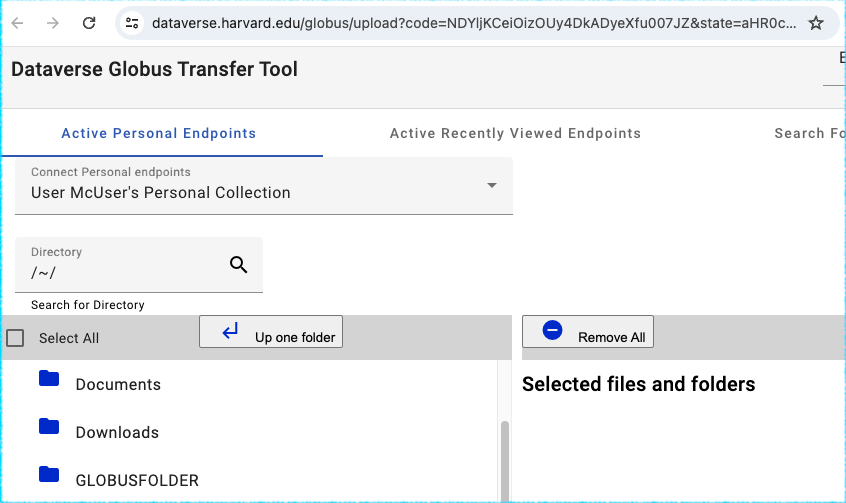
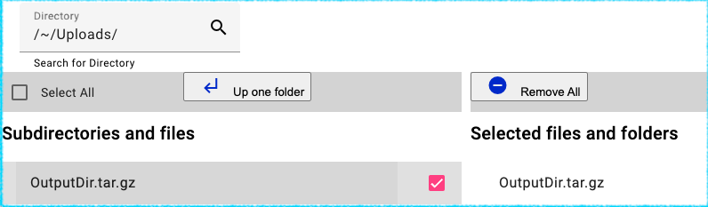

# Uploadig Data via Globus in the Harvard IQSS Dataverse Archive.

## 1. Summary/Introduction

This is a new and experimental service offered by Harvard Dataverse in collaboration with [Mass. Open Cloud](https://massopen.cloud/) (MOC) and [Northeast Storage Exchange](https://nese.mghpcc.org/) (NESE) for researchers looking to deposit large amounts (TBs) of data (aka "Big Data"). It combines the curation, publishing and access control capabilities of Dataverse with the existing Big Data storage infrastructure at NESE.

The most important distinctive feature of this service is that the data are accessible via [Globus Data Transfer](https://www.globus.org/data-transfer) interface only. Globus makes TB-sized transfers, uploads and downloads, practical, it offers a wide range of advanced features, handling interruptions and restarts transparently in the background (among other things). It also makes the upload workflow more complex, compared to the methods traditionally offered in Dataverse, via the web pages or the API. (In other words, the process involves more steps than simply clicking on the upload link in the browser and picking a file on your drive). 

Once deposited, the data files are physically stored at the NESE facility (on tape or disk volumes there). Dataverse merely facilitates access to these storage "end points" for users' Globus clients. Neither uploads nor downloads are streamed through Dataverse, but are carried out directly between the Globus end points.

Please see the [Datverse Globus Download](download.md) guide for an overview of the download workflow as seen by the end users who will be accessing your NESE-stored data via Globus. 

If you are aready familiar with Globus, the data upload workflow should be largely intuitive (some familiarity with the basic functionality of Dataverse would also help of course). The instruction below is written with a user who may have never used Globus in mind. 

## 2. Globus pre-requisites:

### a. Globus Account is Required

You may already be able to log in as a Globus user using your school or institution's federated login. Visit [www.globus.org](https://www.globus.org) and click "Login" at the top of the page, then check the list of participating authentication providers. If an institutional login is not an option, you can create a _Globus Id_ at [globusid.org](https://www.globusid.org). For more information please see [How To Log In and Transfer Files with Globus](https://docs.globus.org/guides/tutorials/manage-files/transfer-files/).

### b. Source Data as a Globus Collection

Globus protocol is based around the idea of transferring data between _collections_. So, in order to be able to transfer your data to the _destination collection_, the storage volume at the NESE data center, it needs to be accessible as part of a _source collection_ under Globus. A relatively simple, and free solution is available for uploading local files from your computer (described in the next section). 

It is however possible that the data you are depositing is already accessible under Globus elsewhere. A real life example would be a collection of research data stored in an S3 bucket to which your University provides a Globus interface front via [AWS S3 Connector](https://docs.globus.org/premium-storage-connectors/v5.4/aws-s3/). Under this scenario Dataverse will be able to initiate a direct transfer between the two end points, provided your Globus account has read access to the source data. Globus offers [connectors](https://docs.globus.org/premium-storage-connectors/v5.4/) to various other types of shared mass storage (Ceph, Google Cloud Storage, Azur Blob Storage and more) but the licenses are somewhat expensive, even for academic institutions. If this is your use case (source data already readable within the Globus framework), you can skip the next section and go directly to part 3.	

### c. Globus Connect Personal 

[Globus Connect Personal](https://www.globus.org/globus-connect-personal) is a free client offered by Globus. Linux, Mac and Windows versions are available. Once installed on your computer, Globus Connect Personal will make your local files visible to the Globus network as a collection that can be used as the data transfer source. It will be limited initially to your home directory, but any other directory or volume local to your system can be added. "Local" in this context means files directly stored on your laptop, but also any external hard drives or any remote volumes (NFS, etc.) mounted over the network. 

When you start Connect Personal, you will be asked to log in using your Globus account. Verify that your new collection is properly set up by clicking the "Web: Collection Details" in the menu (MacOS version shown):

This should take you to the Globus Web App page, confirming that your personal collection is now part of the Globus federation:

If necessary, add any extra folders containing the data you are depositing to the collection in the _Access_ panel under _Preferences_. Since you are transferring data _from_ your collection, it is safe to leave the "Write Access" box unchecked. The "Shareable" box does not need to be checked either, unless you actually need to make your personal collection accessible to other Globus users.

## 3. Borealis Globus App

The upload process relies on an extra software component, [dataverse-globus](https://github.com/scholarsportal/dataverse-globus), a web tool that serves as an interface between Dataverse and Globus. It is being developed by Borealis (formerly Scholars Portal), the Canadian Dataverse Repository project. Clicking the "Upload with Globus" on the _Upload Files_ page in the Dataverse UI will redirect you to the Borealis App in a new tab:

(If you are not seeing the "Upload with Globus" button above on the uploads page, that likely means that your Dataverse Collection has not yet been configured to use NESE storage - please contact support to have that straightened out)

The app will prompt you to log in using your Globus credentials, giving you a choice of authentication providers (make sure to use an account that has read access to your source collection, in case you have more than one):

The Borealis App will inform you if Globus Connect isn't installed or properly configured on your local system, giving you an option to select a different Globus collection:

Otherwise the app will show 2 panels, source on the left, and the destination on the right: 

## 4. Initiating Globus Upload

Navigate to the file you want to upload in the left panel and check the box next to it. It should now appear on the right, in the _destination_ panel: 

then click _Submit Transfer_ at the bottom of the page:

You should see the "Transfer Initiated" message. You can safely close the Borealis App at this point, since its job is done. The transfer is now happening between the 2 Globus endpoints directly (your instance of Globus Connect Personal needs to be running for the duration of the proces; the process can be safely interrupted however - the transfer will restart automatically once the collection is up and running again). The Dataset will remain locked while the transfer is in progress. 

You can use the [Activity](https://app.globus.org/activity) tab of the Globus Web App to monitor the progress. 

Please keep in mind the experimental and _work in progress_ nature of both the Globus integration support in Dataverse and the Borealis app. Please report to us any problems you may encounter in the process. 