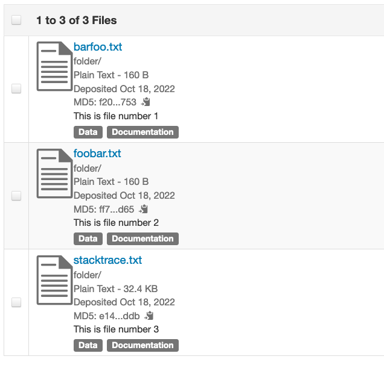

This is a quick implementation of Direct Upload in Python.

Created originally for #191 but could be of use to other users who upload data to Dataverse from Python scripts. (pyDataverse has been very popular and useful, but it does not support newer Dataverse functionality, such as direct upload, and its development is currently on hold).

This implementation is simplified and cuts some corners (it does not support files larger than 1GB; it calculates the md5s in a fairly inefficient way; it could use better error handling).

There are 2 separate methods in directupload.py. One used to directly upload an individual file to storage. The second to finalize saving one or more files at once on the Dataverse side. This way we handle saving all the filemetadata entries, including the descriptions and tags, etc. for all the files in one bulk API call, eliminating all the extra reindexings performed when individual files are uploaded using the "classic" API upload method. There are comments in the code explaining what’s going on.

As a use example, the main() method of the script implements a command line utility that uploads every file in the specified directory, as shown in the following example.

We have a folder with 3 files in it:
```
% ls folder
barfoo.txt	foobar.txt	stacktrace.txt
```
We run the script as follows:
```
% python directupload.py folder
This script will attempt to read the files in the folder folder
(just the files immediately in the folder, will not crawl recursively)
and upload them to the dataset doi:10.70122/FK2/DQPOQN on http://localhost:8080
using direct upload method for the individual files, then performing
just one /addFiles api call to finalize saving the uploaded files
on the Dataverse side.
attempting to upload file: barfoo.txt
success.
attempting to upload file: foobar.txt
success.
attempting to upload file: stacktrace.txt
success.
Attempting to finalize saving the files with Dataverse...
Yay, success!
```
The url of the Dataverse, the destination dataset and the authorized API key need to be specified inside the script.

The end result will look like this:



Others are encouraged to extend this implementation and share the resulting code with the community. The next logical steps would be to: implement multipart S3 uploads (this currently limits uploads to AWS to 1GB); implement calculating the md5 of the file while it's being streamed to S3 (i.e., doing both in one pass, saving having to read the file twice - which could be a significant improvement with large files); overall better diagnostics and error handling. The Java code implementing all this in DvUploader can be used as a model.

